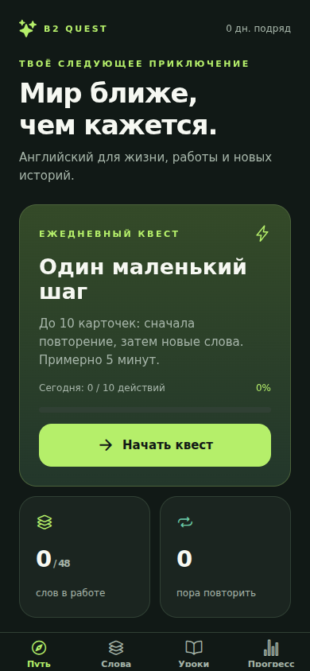

# B2 Quest 🧭

**Английский для жизни, работы и новых историй.** Android-приложение для русскоязычных начинающих: маленькие ежедневные занятия, полезные фразы и повторение без штрафов за ошибки.



## Что работает в версии 0.1

- **48 слов и фраз** в 6 колодах: первые разговоры, дорога, жильё, еда, работа и аналитика, связная речь.
- Карточки с переводом, **британской IPA**, приблизительной русской подсказкой, примером и его переводом.
- Озвучка слова и примера через системный синтез речи. Предпочтение британскому голосу; при его отсутствии используется доступный английский.
- **4 урока произношения**: чтение IPA, ударение и долгота, th, гласные, /w/, /ŋ/, /ə/.
- **8 уроков грамматики A1–A2**, по 3 вопроса: to be, Present Simple/Continuous, Past Simple, будущее, Present Perfect, артикли, модальные глаголы.
- Сессия до 10 карточек: просроченные повторения идут перед новыми словами.
- Интервальное повторение по самооценке памяти, избранное, поиск, тематические фильтры.
- Сохранение прогресса на устройстве, XP, серия дней, ежедневная цель и отключение русских подсказок.

**Название — цель, а не обещание результата.** Сейчас это стартовый курс A1–A2, не полный курс до B2. Игровой уровень и XP не определяют уровень CEFR. Русские подсказки не передают звуки точно и не заменяют IPA или слушание.

## Запуск на Android через Expo Go

Понадобятся компьютер, Node.js **22.13+**, Git и приложение **Expo Go с поддержкой SDK 57** на телефоне.

```bash
git clone https://github.com/Zh-Alisher/b2-quest.git
cd b2-quest
npm ci
npm start
```

Компьютер и телефон должны быть в одной Wi-Fi-сети. Открой Expo Go на Android и отсканируй QR-код из терминала. Если подключение по локальной сети блокируется, можно попробовать `npx expo start --tunnel`; потребуется доступ к сети и установка предложенного tunnel-пакета. Если Expo Go сообщает о несовместимом SDK, установи совместимую Android-версию через [официальную страницу Expo Go](https://expo.dev/go).

Для проверки интерфейса в браузере:

```bash
npm run web
```

Экран маленький? На вебе включи мобильный режим браузера. Интерфейс один и тот же: React Native, без отдельного макета сайта.

## Устанавливаемый APK

**Готовый APK в этой версии не приложен.** Android JS-бандл проверен; сборка нативного APK и запуск на реальном телефоне пока не выполнялись. Для облачной сборки нужен аккаунт [Expo](https://expo.dev).

```bash
npx eas-cli@latest login
npx eas-cli@latest build:configure
npx eas-cli@latest build --platform android --profile preview
```

EAS создаст проект в твоём аккаунте и предложит настроить ключ подписи. Сохрани доступ к аккаунту и ключам: они понадобятся для обновлений приложения. Профиль `preview` в `eas.json` создаёт APK для установки на телефон. После завершения сборки открой ссылку EAS на телефоне и скачай APK. Это самостоятельное приложение: сервер разработки для него не нужен. Облачная сборка зависит от квот/тарифа Expo; публикация в Google Play здесь не настроена.

Профиль `production` подготовлен для AAB. Он сам по себе ничего не публикует.

## Как работает повторение

| Ответ          | Следующее повторение                       |
| -------------- | ------------------------------------------ |
| Не помню       | Через 10 минут; серия успехов сбрасывается |
| С трудом       | Через 1 день; серия не увеличивается       |
| Помню уверенно | Через 1 → 3 → 7 → 14 → 30 → 60 дней        |

Очередь фиксируется в начале сессии. Забытые карточки вернутся в следующей сессии после своего срока. Максимум — 10 карточек за сессию. Уверенная оценка даёт 10 XP, другие — 5 XP. Урок завершён при 3/3 правильных ответах; 30 XP выдаются только при первом завершении. «Закреплено» означает минимум три успешных повторения подряд по самооценке.

Цель 5/10/15 — число действий за день, не длительность занятия. Оценка карточки и первое прохождение урока считаются по одному действию. Серия дней использует локальную дату телефона; если сегодня ещё не занимался, учитывается серия до вчерашнего дня.

## Данные и звук

Учебные материалы включены в приложение. В установленном APK чтение уроков, тесты, повторения и прогресс работают без сервера. Для офлайн-озвучки нужен установленный английский голос; некоторые системные голоса требуют интернет. Запуск через Expo Go зависит от сервера разработки.

Нет регистрации, рекламы, API-ключей, микрофона, AI-диалогов или отправки учебного прогресса на сервер. Прогресс хранится в AsyncStorage, без шифрования. Удаление приложения, очистка данных или хранилища браузера удалит его; резервное копирование и синхронизация пока не реализованы. При невозможности прочитать сохранение приложение показывает ошибку и не перезаписывает данные пустым профилем.

## Разработка и проверка

Стек: TypeScript, React Native, Expo SDK 57, Expo Router, AsyncStorage, Expo Speech. Навигация — файловые маршруты.

```bash
npm run check
npx expo-doctor
npx expo export --platform android --platform web
```

`check` запускает TypeScript, ESLint и тесты логики повторений/контента. Тесты покрывают расписание, сброс после забывания, приоритет очереди, начисление XP, серию дней и отказ при повреждённом сохранении.

```text
src/app/        экраны и навигация
src/content/    карточки, уроки, вопросы
src/core/       интервалы, прогресс, хранение
src/ui.tsx      общие компоненты и оформление
tests/         проверки логики и контента
docs/          план развития и скриншоты
```

Контент написан специально для проекта. Это небольшой тематический набор, **не рейтинг 1000 частотных слов**. Перед расширением курса нужна дополнительная редактура преподавателем английского.

## Следующие главы

План развития — [ROADMAP.md](docs/ROADMAP.md). Дальше: словарь с редактурой, аудирование, запись и сравнение голоса, реальные диалоги, полноценные главы B1–B2. Эти возможности пока не реализованы.

Документация: [Expo Router](https://docs.expo.dev/router/introduction/), [Speech](https://docs.expo.dev/versions/v57.0.0/sdk/speech/), [Android APK](https://docs.expo.dev/build-reference/apk/).

Лицензия: MIT.
